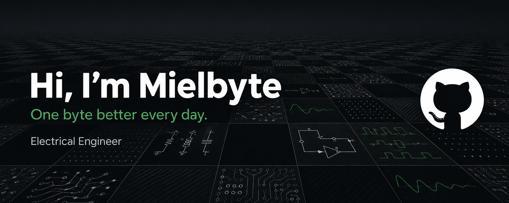

  

## About Me

I'm an Electrical Engineering graduate interested in Control Systems, Automation, and Artificial Intelligence.

I enjoy exploring how intelligent technologies can be applied to real-world engineering systems.

## Interests

* ⚙️ Control Systems
* 🔌 Electrical Engineering
* 🤖 Artificial Intelligence
* 🛠️ Automation

## Currently Learning

* System modeling and simulation
* Control system design
* Machine learning fundamentals

## Languages and Tools

  
  

## Connect with Me

  
  
  

---

  <i>One byte better every day.</i>

